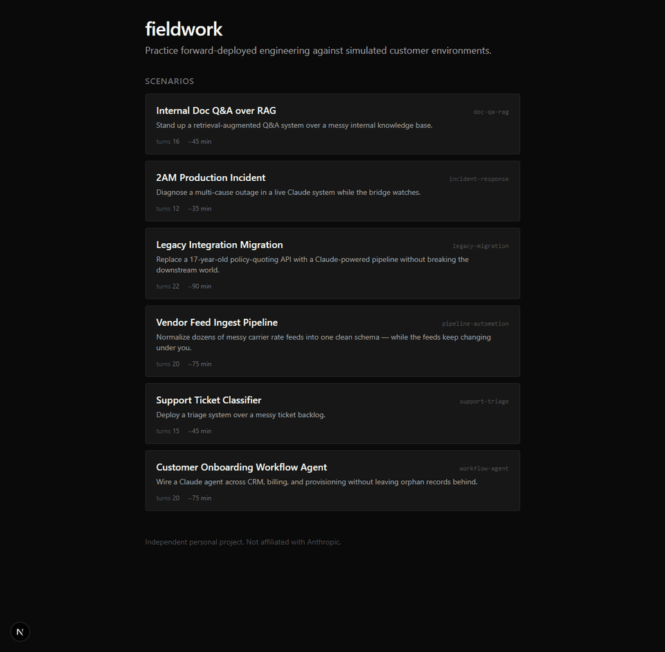

# fieldwork

**Practice forward-deployed engineering against simulated customer environments.**



fieldwork is a self-hosted training simulator for FDE-style work: deploying
AI-powered systems against messy, realistic customer environments. Each scenario
drops you into a simulated company with ambiguous requirements, incomplete docs,
and stakeholders who don't always know what they want — then scores how well you
navigate it.

Built on the Anthropic API. Works with any recent Claude model.

> **Independent personal project. Not affiliated with Anthropic.**

---

## What is FDE work?

Forward-deployed engineers embed with customers to build and ship real
integrations — usually against undocumented APIs, inconsistent data, and
shifting requirements. It's part software engineering, part product work,
part consulting. fieldwork lets you practice the messy parts without a
real customer on the line.

## Quick start

```bash
git clone https://github.com/<you>/fieldwork
cd fieldwork
pnpm install
cp .env.example .env
# add your ANTHROPIC_API_KEY to .env
pnpm dev
```

Open http://localhost:3000, pick a scenario, and get to work.

Want more detail on setup, prerequisites, and running the CLI/tests? See
[docs/getting-started.md](docs/getting-started.md).

## How it works

Every scenario is a YAML manifest describing a simulated company: its industry,
tech stack, data schemas, stakeholders, and the surprises lurking in its data.
When you take an action — write a prompt, query the simulated API, message a
stakeholder — an "inner Claude" plays the environment and responds with
realistic changes, pushback, and edge cases.

At the end, a debrief Claude reviews your action log against a rubric and tells
you where you did well and where you got stuck — citing specific turns and
proposing the prompts you could have written instead.

### Core mechanics

- **Discoverable objectives** — some objectives are hidden at turn 0 and only
  become visible when the trainee asks the right question or a stakeholder
  volunteers the concern. Building blind means you never learn what you're
  being measured on until the debrief.
- **Stakeholder trust** — each stakeholder starts at 0.5 trust and moves based
  on whether the trainee earns their confidence (good questions, acknowledging
  concerns) or loses it (dismissing feedback, compounding mistakes). Low trust
  makes stakeholders terser; high trust unlocks insider info.
- **Turn budget + cost display** — scenarios can cap turns to force
  prioritization. Live USD cost tracking tells you what each turn spent against
  the Anthropic API.
- **Prompt caching + model tiering** — world bible and ticket samples cache
  across turns. Routine turns run on Haiku 4.5; stakeholder-heavy and
  surprise-firing turns use Sonnet. Debrief always uses Sonnet.

See [docs/architecture.md](docs/architecture.md) for the full breakdown.

## Scenarios

| # | Scenario                   | Tier | Focus                                           |
| - | -------------------------- | ---- | ----------------------------------------------- |
| 1 | Support Ticket Classifier  | 1    | Prompt engineering, taxonomy design             |
| 2 | Internal Doc Q&A (RAG)     | 1    | Chunking, retrieval, hallucination mitigation   |
| 3 | Data Pipeline Automation   | 2    | Schema drift, data quality                      |
| 4 | Multi-Step Workflow Agent  | 2    | Tool design, error recovery                    |
| 5 | Legacy System Migration    | 3    | Incomplete docs, stakeholder resistance         |
| 6 | Production Incident Response | 3  | Diagnosis under time pressure                  |

Want to add one? See [docs/writing-scenarios.md](docs/writing-scenarios.md).

## Self-hosted deploy

A deploy script lives at [`scripts/deploy-staging.sh`](scripts/deploy-staging.sh).
It ships your local tree to a server via tar-over-ssh, installs, builds, and
restarts the Next.js process — all in one command.

Set `FW_HOST` to your SSH target (export it in your shell profile for
repeat use):

```bash
export FW_HOST=user@your-host.example    # required
export FW_PORT=3005                      # optional, default 3005
export FW_REMOTE_DIR=~/fieldwork         # optional, default ~/fieldwork
```

Then:

```bash
./scripts/deploy-staging.sh            # full: transfer + install + build + restart
./scripts/deploy-staging.sh --fast     # transfer + build + restart (skip install)
./scripts/deploy-staging.sh --restart  # restart only
./scripts/deploy-staging.sh --stop
./scripts/deploy-staging.sh --logs
./scripts/deploy-staging.sh --env      # list env var names on remote (values redacted)

# Set the Anthropic API key (written to remote <FW_REMOTE_DIR>/.env with
# chmod 600, auto-sourced on every restart):
FW_KEY=sk-ant-... ./scripts/deploy-staging.sh --set-key
```

The server auto-sources `<FW_REMOTE_DIR>/.env` on every start, so you can
also edit it directly over ssh and run `--restart`.

### HTTP Basic Auth

fieldwork ships with optional HTTP Basic Auth that gates every route except
`/api/health`. It's **off by default** so local `pnpm dev` works with zero
config — set a password to turn it on.

```bash
# Set Basic Auth credentials on the deploy target (writes to remote .env,
# chmod 600, restarts the server):
FW_AUTH_USER=you FW_AUTH_PASS=strong-password-here \
  ./scripts/deploy-staging.sh --set-auth
```

Once set, the browser will prompt for credentials on first visit and cache
them for the session. `curl` callers use `-u user:pass`. The health check
endpoint stays unauthenticated so the deploy script's readiness probe and
any external monitors still work.

> **Important.** Without auth, the app has no rate limiting on `/api/turn`,
> so anything that can reach the port can spend your Anthropic budget. If
> you expose the server to the public internet at all, turn auth on.

## Self-host only

fieldwork runs locally. There is no hosted demo. You bring your own Anthropic
API key and your data never leaves your machine.

## Project status

**Phase 1 playable.** All six scenarios in the catalog are authored, schema-valid,
and loadable through the web app. Support Ticket Classifier and Internal Doc Q&A
are the scenarios exercised end-to-end on a live API (turn loop, stakeholder
dialogue, discoverable objectives, trust tracking, per-turn objective
transitions, cost tracking). The other four Tier 2–3 scenarios are authored
but haven't been played on live API yet.

Working:

- Full turn loop against the Anthropic API with prompt caching + model tiering
- Deterministic ticket generator (mulberry32 RNG + manifest distribution/noise)
- JSON file session persistence (`data/sessions.json`, survives server restart)
- Stakeholder trust meter with colored bars in the briefing panel
- Turn budget and live USD cost display
- Deterministic per-turn objective scoring via manifest `rubric` rules
  (`action_kind` / `payload_contains` / case-insensitive `payload_regex`)
- Surprise engine with `turn_count`, `objective_state`, `action_pattern`, and
  `random` triggers
- Collapsible action log viewer
- End-of-scenario debrief with turn-specific, alternative-prompt critiques
- `fieldwork validate` CLI wired to the scenario schema
- 34 passing unit tests across core, rubric, and scenarios

Not yet built (see [TODO.md](TODO.md)):

- Inner Claude response streaming (currently blocks the UI 5–15s per turn)
- SQLite session persistence (to replace the single-writer JSON file store)
- Action log summarization for long runs (prompt bloats past ~20 turns)
- Cross-session history and analytics

## Contributing

Scenarios are the main contribution surface. See
[CONTRIBUTING.md](CONTRIBUTING.md) for the authoring workflow and the scenario
schema.

## License

MIT. See [LICENSE](LICENSE).
